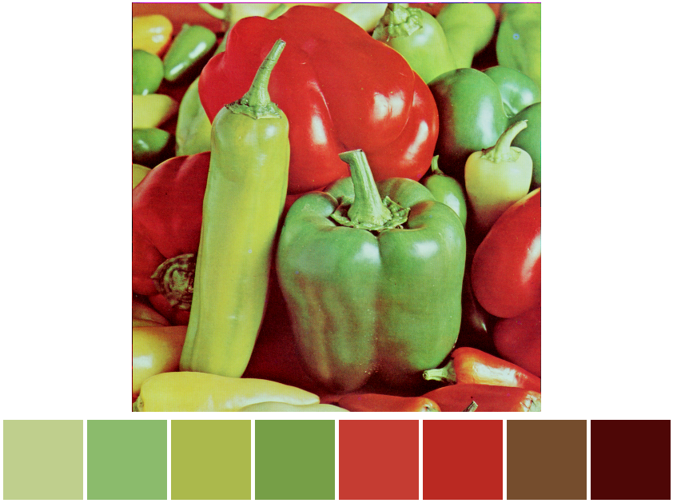

[](https://github.com/Kaesebrot84/iris/actions/workflows/Build.yml)

## Iris

A command line tool that creates color palettes from images using the [median cut algorithm](https://en.wikipedia.org/wiki/Median_cut).

## Usage

```sh
cliris 0.1.0
A command line tool that creates color palettes from images using the median cut algorithm.

USAGE:
    cliris [OPTIONS] --file-name <FILE_NAME> [OUTPUT_FORMAT]

ARGS:
    <OUTPUT_FORMAT>    Desired data file format to be written [default: none] [possible values:
                       none, html, json, csv]

OPTIONS:
    -f, --file-name <FILE_NAME>          Target image file name
    -h, --help                           Print help information
    -i, --iterations <ITERATIONS>        Number of iterations [default: 1]
    -o, --out-filename <OUT_FILENAME>    File path the file should be written to [default: palette]
    -V, --version                        Print version information

```

### Installation

```bash
cargo install cliris
```


### Example

```sh
cliris -f Lenna.png -i 3 html

Image: (512, 512) - Rgb8
Finished reading 262144 pixel values in 71 ms.
Generating palette...
Finished generating palette in 1550 ms.

{ R: 230, G: 191, B: 167, A: 255 }
{ R: 205, G: 137, B: 137, A: 255 }
{ R: 227, G: 127, B: 108, A: 255 }
{ R: 201, G: 115, B: 110, A: 255 }
{ R: 190, G: 86, B: 95, A: 255 }
{ R: 175, G: 67, B: 77, A: 255 }
{ R: 114, G: 46, B: 87, A: 255 }
{ R: 98, G: 23, B: 61, A: 255 }

```

<p align="center">
    
</p>

